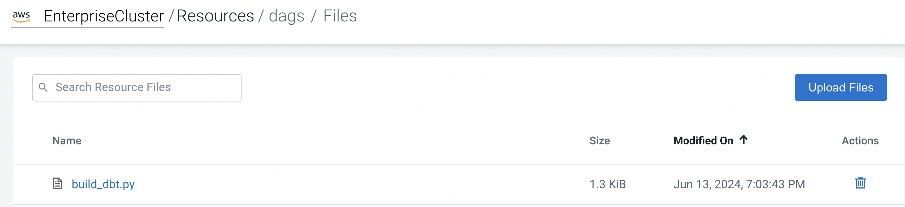

# dbt_airflow_airlinedata
DBT with Airflow on Airlinedata

## create Database - Hue

Navigate to Data Warehouse, then Virtual Warehouse and open the HUE SQL Authoring tool.

Create new database for your user to be used, or use one that is already created for you.

```sql
-- Change *** of database name
CREATE DATABASE dbt_airlinedata;

USE dbt_airlinedata;
```

## create external Tables - Hue

Run DDL to create four external tables on the CSV data files, which are already in cloud object storage.

```sql
drop table if exists flights_csv;
CREATE EXTERNAL TABLE flights_csv(month int, dayofmonth int,
 dayofweek int, deptime int, crsdeptime int, arrtime int,
 crsarrtime int, uniquecarrier string, flightnum int, tailnum string,
 actualelapsedtime int, crselapsedtime int, airtime int, arrdelay int,
 depdelay int, origin string, dest string, distance int, taxiin int,
 taxiout int, cancelled int, cancellationcode string, diverted string,
 carrierdelay int, weatherdelay int, nasdelay int, securitydelay int,
lateaircraftdelay int, year int)
ROW FORMAT DELIMITED FIELDS TERMINATED BY ',' LINES TERMINATED BY '\n'
STORED AS TEXTFILE LOCATION '/airlinedata-csv/flights' tblproperties("skip.header.line.count"="1");

drop table if exists planes_csv;
CREATE EXTERNAL TABLE planes_csv(tailnum string, owner_type string, manufacturer string, issue_date string, model string, status string, aircraft_type string, engine_type string, year int)
ROW FORMAT DELIMITED FIELDS TERMINATED BY ',' LINES TERMINATED BY '\n'
STORED AS TEXTFILE LOCATION '/airlinedata-csv/planes' tblproperties("skip.header.line.count"="1");

drop table if exists airlines_csv;
CREATE EXTERNAL TABLE airlines_csv(code string, description string) ROW FORMAT DELIMITED FIELDS TERMINATED BY ',' LINES TERMINATED BY '\n'
STORED AS TEXTFILE LOCATION '/airlinedata-csv/airlines' tblproperties("skip.header.line.count"="1");

drop table if exists airports_csv;
CREATE EXTERNAL TABLE airports_csv(iata string, airport string, city string, state string, country string, lat DOUBLE, lon DOUBLE)
ROW FORMAT DELIMITED FIELDS TERMINATED BY ',' LINES TERMINATED BY '\n'
STORED AS TEXTFILE LOCATION '/airlinedata-csv/airports' tblproperties("skip.header.line.count"="1");

```

## clone github

```bash
git clone https://github.com/frothkoetter/dbt_airflow_airlinedata.git
```


## configure cli

get CDE virtual Cluster Job API URL
https://2fksc2c5.cde-mxhdhlq7.se-sandb.a465-9q4k.cloudera.site/dex/api/v1

```bash
% cd
% cd .cde
% ls
config.yml	credentials

% vi config.yml
user: frothkoetter
vcluster-endpoint: https://2fksc2c5.cde-mxhdhlq7.se-sandb.a465-9q4k.cloudera.site/dex/api/v1
```

## build dbt

```bash
% cd /../dbt_airlinedata

% ./build-dbt.sh
API User Password:
Error: create resource failed: resource with name already exists
    1.4KB/1.4KB 100% [==============================================] build_dbt.py
Error: create resource failed: resource with name already exists
    20.0b/20.0b 100% [==============================================] sample_requirements.txt
Error: create resource failed: resource with name already exists
{
 "id": 64
}
```

This job takes approx 12 minutes to complete

check CDE resources
venvs:


requirements:


dags:


## create job

```bash

./create-job.sh
API User Password:
     1.3KB/1.3KB 100% [==============================================] dbt_airlinedata.py
     5.7MB/5.7MB 100% [==============================================] dbt_airlinedata.zip
```

Check Airflow UI:

